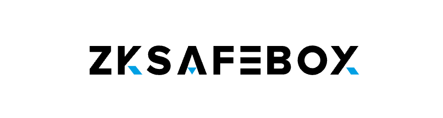
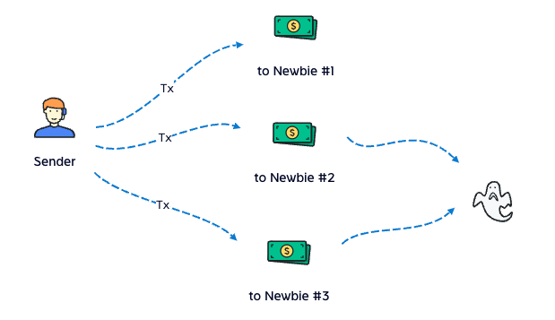
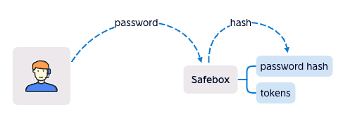
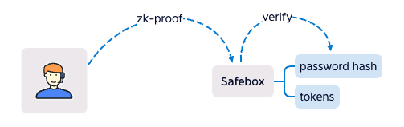
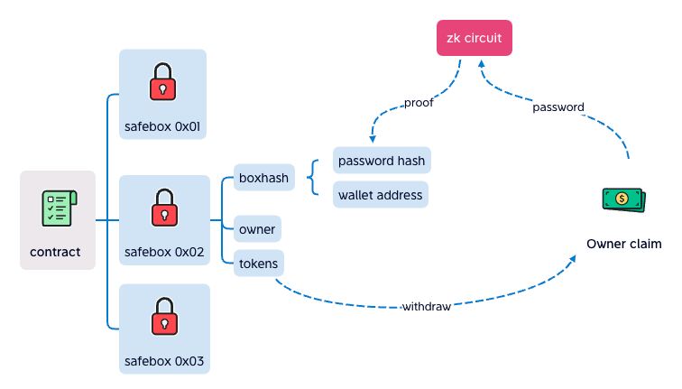

 ZKSafebox is double security for assets, your private key and your password. with ZK-SNARK, the password is hided. The contracts have no owner, no backend, that means ZKSafebox is running as a protocol.

### Double Security
<b><ul>
    <li>Private key is taken, safebox is still safe.
    <li>Password is taken, safebox is still safe.
    <li>Both private key and password are taken, that's so bad.
</ul></b>
 
 

### Story of ZKSafebox

Last year, we got 3 new teammates, they were newbies in Web3, we taught them to use wallet, told them the traps, but after the salary payment, 2 of 3 had bean stolen, because they donwloaded the fake Metamask.

We recognize that the newbie's money is much easier to be stole.

Even OG as we are, I still worry about my wallets.

So We build safebox for everyone, give assets double safety.

 
 

### 1. Basic Theory

User create a safebox with password hash in the contract, the only way to withdraw from safebox is sending the correct password. So if the private key is taken by the hacker, without password, the hacker can't withdraw tokens from safebox.

But the problem is that if the password was sent, everyone knows the password.

So we use ZK-SNARK instead.

It can hide password, it works like signature, user signs the data with password, and the contract verify the signature.

Actually, safebox use boxhash instead of password hash, which is hashed from password hash and wallet address, so every wallet has different boxhash, even though thay have the same password, if the password hash is cracked (like "password" or "123456" is much easy to be cracked), boxhash is still safe.

One safebox to One wallet, only the owner can withdraw, if the boxhash is cracked, the safebox is still safe.

Following is how the "sign" works in zk circuit (in zk, the algorithm is called circuit).

Poseidon is a kind of hash algorithm, it's circuit friendly and popular in zk circuits, the SHA256 we tried, but it didn't work well, so we chose Poseidon circuit instead.

User input password, tokenAddr and amount, that means user knows the password, and he want to take the amount of token. The zk circuit output the proof and the result data, to proof that the password hash is generated by the hash algorithm, if the result modify, the verify in the contract will fail.

The better than signature algorithm, we can design the output in zk. The result contains not only password hash, but also tokenAddr, amount, all hash. After verify success in contract, it will take amount of token from the correct safebox.

About Double Spent: 
The used proof was recorded in contract, so double spent is impossible. In other side, the proof is quite different every time, in zk circuit, even though input the same data, it'll output the same, but the proofs are different. So the safebox owner can withdraw the same thing every time.

 
 

### 2.Social Recover

There're 2 options:

<ul>
    <li>Set boxhash cover wallets, if user forget the password, they can help to clear the password, then reset the password. 
    <li>Set owner cover wallets, if user forget the private key, they can help change the owner. For safty, this option need password be cleared first. 
</ul>

Setting cover wallets need user's password, user should do this before forget it.

 
 

### 3.Extend Feature
<ul>
<li>Withdraw To ERC20Receiver

Supply IERC20Receiver, deposit to ERC20Receiver contract (like Swap or Farming), it donsen't need approve.

<li>Internal Transfer

Assets transfer from safebox to safebox.

</ul>
 
 

## FAQ
<ul>
<li>Where is the password store?

In your mind.

<li>If the project fail or be hacked, is my safebox safe?

Yes, the safebox is in the contract, and the contract has no owner, it's running forever and no one can modify it.

<li>How long did zkSafebox developed?

Since 2022-5-4 to 2022-5-11, we built zkPayroll for BNB Hackthon <https://dorahacks.io/buidl/2790>.
 Then 2022-5-23, we split zkPay from zkPayroll, rebuild as zkSafebox, for ETH Hackthon <https://gitcoin.co/issue/28870>.
 Future, zkSafebox will lanuch stand-alone.

<li>What is the product design base on?

Stay simple, stay protocol.
 A assets tool as Metamask.

<li>What is the future plan?

Safe to earn? I guess. 
</ul>